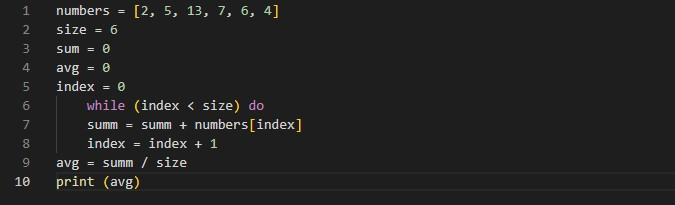

# ИНСТРУКЦИЯ ДЛЯ РАБОТЫ С Markdown

## ВЫДЕЛЕНИЕ ТЕКСТА

Чтобы выделить текст курсивом - использовать "*" или "_"

Например, *вот так* или _так_

Чтобы выделить текст полужирным - использовать "**" или "__"

Например, **вот так** или __так__

Альтернативные спсосбы выделения текста жирным или курсивом нужны для того, чтобы мы могли совмещать оба этих способа.

Например: _Текст может быть выделен курсивом и при этом быть **полужирным**_.

## СПИСКИ

Чтобы добавить **ненумерованные** списки, необходимо пункты выделить "*" или знаком "+".
Например, вот так:
* Один;
* Два;
* Три;
+ Четыре.

Чтобы добавить **нумерованные** списки, необходимо пункты пронумеровать.
Например, вот так:
1. Один;
2. Два;
3. Три;

## РАБОТА С ИЗОБРАЖЕНИЕМ

Чтобы вставить изображенеи в текст, достаточно написать следующее:

## ССЫЛКИ

## РАБОТА С ТАБЛИЦАМИ

## ЦИТАТЫ

